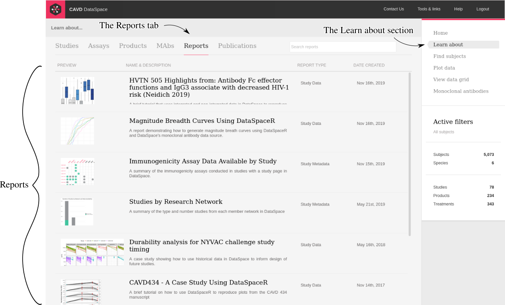

# CAVD DataSpace Reports
## What are DataSpace Reports?

[DataSpace](https://dataspace.cavd.org/cds/CAVD/app.view) is a data sharing and discovery tool for HIV clinical and pre-clinical vaccine studies. Dataspace offers an interactive way to explore information and data regarding HIV vaccine trials from multiple HIV vaccine trial networks via a web based graphical user interface or an interactive R API.

DataSpace reports are reports contributed by the DataSpace team, or other members of the research community. These reports are designed to explore or analyze data from the application and they can be viewed in the application in the "Learn about" section.

All contributed reports are generated via R Markdown, and data is extracted from the application for the reports via [DataSpaceR](https://github.com/ropensci/DataSpaceR). DataSpaceR is the R based API for accessing data from DataSpace. In combination with R Markdown, reports can be run locally, or in the application when added by the DataSpace team.

DataSpace reports are designed to show workflows, reproduce results from publications, explain content in the application, show results of an exploratory analysis, or explain immunology concepts.

## Where to view reports in DataSpace.

Rendered DataSpace reports can be found by:

* logging into DataSpace, 
* going to the Learn about section, 
* then clicking on the Reports tab.



## What is the purpose of this repository.

This repository stores all the report code found in the application. It stores all the report code for reports found in Learn, as well as the code used to generate the reports found in the ("Monoclonal antibody" section.)[https://dataspace.cavd.org/cds/CAVD/app.view#mabgrid]

R Markdown files in this repository are available to the public and may be used to generate reports, as seen in the application in a local environment, or as example code for writing new or modified reports. This repository alos provides an opportunity for other members of the HIV vaccine research community to contribute code for new reports, which can be included in the application along with the reports developed by the DataSpace team.

Please notify the DataSpace team of any presentations or publications resulting from the report code found in this repository and/or data obtained from DataSpace. Remember to acknowledge the CAVD DataSpace, as well as the grant and study investigators.

## How to contribute.

DataSpace users are welcome to submit report code to be displayed in the application. Reports can be submitted by making a pull request with the following considerations:

* Rmd files are to be added to this repository's [reports](reports) folder.
* Any dependency code required by the report is to be added to the [dependencies](dependencies) folder, in a folder with the same name of the report.
* A graphic to be displayed with the report summary should be added to the [thumbnails](thumbnails) directory.
* All data accessed by the report in the Rmd should be accessed via the DataSpaceR API.
* Rmd files are knitted to HTML using the yaml header: 

```` yaml
---
output: html_document
---
````

* For best results, also use the following chunk at the top of the report.

```` r
```{r set-options, include=FALSE}
knitr::opts_chunk$set(
  warning = FALSE,
  message = FALSE,
  highlight = TRUE,
  tidy = TRUE,
  fig.align = "center"
  )
```
````

To use our CSS, add the following text to the markdown of the Rmd file.

```html
<link rel="stylesheet" type="text/css" href="../../_webdav/CAVD/@files/CAVD-DataSpace-Reports/dependencies/css/RReport_condensed.css">
```

Once the report is ready to submit, make a pull request and we will review the report for submission to DataSpace.

## Questions?

If you have any questions please reach out to our team.

Contact DataSpace support: dataspace.support@fredhutch.org
